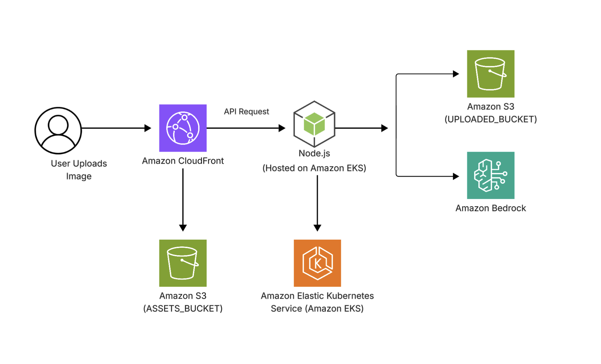

# AI Caption Studio

AI Caption Studio is a full-stack web application that allows users to upload images and automatically generate AI-powered captions and hashtags using Amazon Bedrock.

## 🧠 How It Works

1. User uploads an image from the browser.
2. Frontend sends the image to the backend API using `FormData`.
3. Backend uploads the image to S3 and returns the file key. (e.g. uploads-1234567-001.JPG)
4. Frontend sends the file key to the AI generation endpoint.
5. Backend retrieves the image from Amazon S3 using the file key.
6. Amazon Bedrock (Nova) analyzes the image and generates:
- A caption
- Relevant hashtags
7. Generated caption and hashtags are returned to the frontend.
8. Frontend displays the image, caption and tags in a polaroid-style card.

## 🏗 Architecture

- Frontend hosted on Amazon S3 and CloudFront.
- Backend containerized with Docker and deployed on Amazon EKS.
- Application Load Balancer (ALB) routes traffic to Kubernetes services
- IAM Roles for Service Accounts (IRSA) provide secure AWS access for pods.
- Amazon Bedrock (Nova) generates AI-powered captions and hashtags
- Terraform provisions AWS infrastructure.
- Amazon Bedrock generates AI-powered captions and tags.
- GitHub Actions automates CI/CD deployments.

   
  
   
  Architecture diagram created with Lucidchart

## 🚀 Features

- Upload images from the browser.
- Preview uploaded images instantly.
- Store uploaded images in Amazon S3.
- Generate AI-powered captions using Amazon Bedrock. (Nova)
- Generate relevant hashtags automatically.
- Display results in a Polaroid-style card UI.
- Responsive design for desktop and mobile devices.

## 🛠 Tech Stack

#### ▫️ Frontend

- React
- TypeScript
- Tailwind CSS

#### ▫️ Backend 

- Node.js
- Express.js

#### ▫️ Cloud & Infrastructure

- Amazon S3
- Amazon CloudFront
- Amazon EKS
- Kubernetes
- Amazon Bedrock (Nova)
- Terraform
- GitHub Actions

## ⚙️ Deployment
The application infrastructure is provisioned using Terraform and deployed through a GitHub Actions CI/CD pipeline.

Deployment workflow:

1. Push code to GitHub
2. GitHub Actions builds a Docker image
3. Docker image is pushed to Amazon ECR
4. Amazon EKS deploys the updated application
5. Users access the application through CloudFront and the backend API through an Application Load Balancer (ALB)
